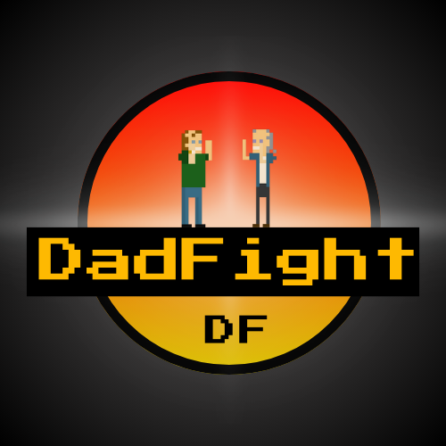

# DadFight 1.0

## About
I came up with the idea for "_DadFight_" a few days after the 2024 Election as a fun side project to explore. I've always been interested in pixel art and have been fascinated by the idea of creating my own game, which led me to pursue this project. The concept for "_DadFight_" is something I thought of as humorously relatable in this political climate, and it’s been a great way for me to practice JavaScript development and experiment with some core concepts essential to game design. Please note, this game is in no means a political statement nor does it reflect any personal ideology 

– it's simply a funny idea that I ran with.

1.0 Release Date: 4/3/2025

**Desktop Version**
👉 <a href="https://alexandersuglio.github.io/DadFight/"> Playable Here </a>

_(Currently in Process of Configuring for Mobile)_

## How To Play
- 🕹 **Move:** Arrow Keys ⬅️ ➡️ let Dad Move Left and Right
- ✊ **Punch:** Spacebar lets Dad Attack

## Written In
- Phaser.js
- CSS/HTML

## Art & Design Credits  
- 🎨 **Sprites & Characters** – Created and designed by me using [**Piskel**](https://www.piskelapp.com), a free online sprite editor.  
- 🌍 **Levels** – Designed by me using [**Pixilart**](https://www.pixilart.com), a free online art community and pixel art tool.

## External Resources Used
- [**retroindiejosh**](https://retroindiejosh.itch.io) (Theme Music, Free to use under CC-BY-SA 4.0)
- [**Zapsplat**](https://Zapsplat.com) (Free-use audio SFX)
- [**PixaBay**](https://PixaBay.com) (Free-use audio SFX) 
